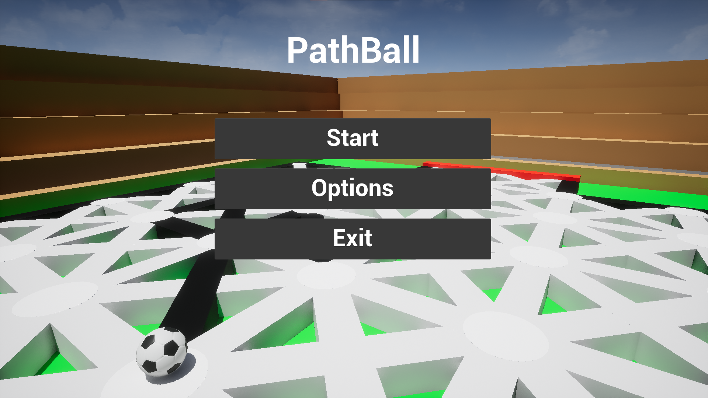
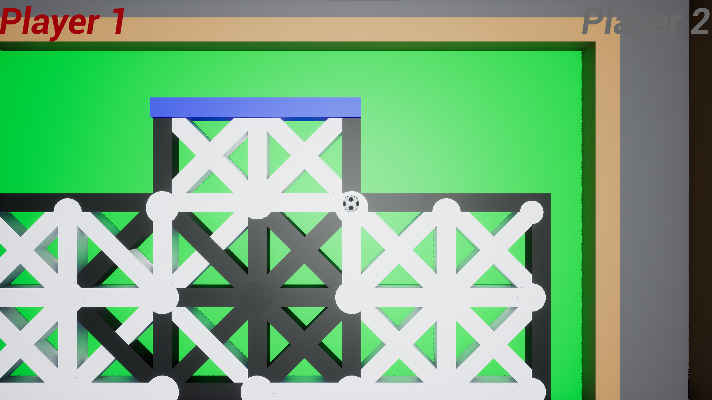

# PathBall :soccer:
Hello :wave: 
I created a game in UE5 for mobile platforms, with a though playing together with others. 
This game is my first even playable project.
The project is not finished, you can add a lot of things to it, but I want to deal with other projects that are on my mind.:satisfied:

## Game mechanic
The mechanics of the game is to move the ball along the paths. The goal of the game is to push the ball into the opponent's goal.
 

You may only push the ball once after each path. So active path are white and inactive tracks are black.
 

## Links
Download game: <a href="https://drive.google.com/file/d/1Sh3jXoLWhmZc6MNdcmapXNZMLjIjyelw/view?usp=sharing">PathBall.exe</a>:point_left: 

Download project: <a href="Edit_Project_PathBall.zip">PathBall.uproject</a>:point_left:
